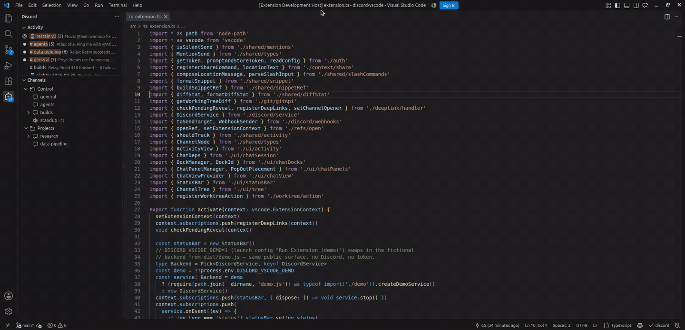
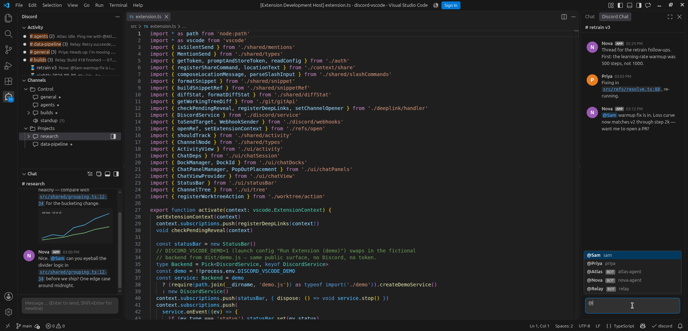

<table border="0"><tr>
  <td valign="middle" width="84"></td>
  <td valign="middle"><h1>Control Channel for Discord</h1></td>
</tr></table>

**Your Discord AI control channel, inside VS Code.**

[](LICENSE)
[](https://code.visualstudio.com/)
[](https://open-vsx.org/extension/c0d3s/control-channel-for-discord)
[](https://github.com/codyslater/control-channel-for-discord/releases/latest)

Live channels and threads in the sidebar · send as yourself · @mention your agents · clickable refs that jump to code · docks, pop-outs, and an activity feed · deep links for bots.



A private Discord server becomes an AI control plane in your sidebar: read channels and threads live, send as yourself (via webhook, with your name and avatar), and click file or traceback references to jump to the right line — local or remote. Bring your own bot token; nothing is shared between installs.

Text and announcement channels and their threads are supported (forum channels are not yet). Voice channels show a live occupant count and open in the Discord app.

## Contents

- [Install](#install)
- [Quick start](#quick-start)
  - [Bot setup](#bot-setup)
  - [Extension setup](#extension-setup)
  - [Settings](#settings)
- [Using it](#using-it)
  - [Sidebar layout](#sidebar-layout)
  - [Docks](#docks)
  - [Pop-out panels](#pop-out-panels)
  - [Activity feed](#activity-feed)
  - [Pins and silence](#pins-and-silence)
  - [Mentions](#mentions)
  - [Slash commands](#slash-commands)
- [For bot authors](#for-bot-authors)
  - [Deep links](#deep-links)
  - [Recognizing your messages](#recognizing-your-messages)
  - [Setting this up for a human (AI agents)](#setting-this-up-for-a-human-ai-agents)
- [Development](#development)
- [Contributing](#contributing)
- [License](#license)
- [Troubleshooting](#troubleshooting)

## Install

**Cursor, Windsurf, VSCodium, code-server, Gitpod, Theia** — search for **Control Channel for Discord** in the Extensions view; these editors install from [Open VSX](https://open-vsx.org/extension/c0d3s/control-channel-for-discord), where it's live.

**VS Code** — the Marketplace listing is pending review. Until it's live, install the `.vsix` manually: download it from the [latest release](https://github.com/codyslater/control-channel-for-discord/releases/latest) (or the Open VSX page), then in the Extensions view open the **⋯** menu → **Install from VSIX…**, or run:

```
code --install-extension control-channel-for-discord-1.0.0.vsix
```

Manual installs don't auto-update — watch the [releases page](https://github.com/codyslater/control-channel-for-discord/releases) for new versions.

## Quick start

> ⚠️ **Guard your bot token like a password.** Anyone who obtains it gains full control of your bot — reading and posting in every channel and DM it can reach, as you. **Never** commit it to git, paste it into a chat, issue, or screenshot, or share it with anyone. This extension stores it only in VS Code's `SecretStorage` (never in settings, files, or source control). If it is ever exposed, reset it immediately in the [Discord Developer Portal](https://discord.com/developers/applications) (**Bot → Reset Token**), which invalidates the old one.

### Bot setup

1. In the [Discord Developer Portal](https://discord.com/developers/applications), create an application, then **Bot → Add Bot**.
2. Under **Privileged Gateway Intents**, enable **Message Content Intent** (without it, message text arrives empty).
3. Copy the bot token (**Bot → Reset Token / Copy**). Keep it secret.
4. Invite the bot with the permission integer **536939520** — View Channels (1024) + Send Messages (2048) + Read Message History (65536) + Manage Webhooks (536870912):

   ```
   https://discord.com/oauth2/authorize?client_id=<APP_ID>&scope=bot&permissions=536939520
   ```

   Replace `<APP_ID>` with your client ID (General Information tab). Already invited with missing permissions? Enable them on the bot's auto-created role under **Server Settings → Roles** instead of re-inviting.

### Extension setup

Requires VS Code 1.106 or newer.

1. [Install the extension](#install).
2. Run **Discord: Set Bot Token** (Command Palette) and paste your token. It is stored only in VS Code's `SecretStorage` — never in settings, files, or source control. This is the only supported way to provide it.
3. Set `discordVscode.userId` to your Discord user ID so sends carry your name and avatar. Enable Discord's **Developer Mode** (User Settings → Advanced), then right-click your name → **Copy User ID**.
4. If the bot is in more than one server, set `discordVscode.guildId` to the target server's ID (right-click the server icon → Copy ID). A single-server bot auto-detects this.

The token is machine-local, so repeat step 2 once per machine and once per Remote-SSH host (the extension runs on the UI side). `guildId`, `userId`, and `hiddenChannels` ride Settings Sync — set once.

### Settings

| Setting | Description |
| --- | --- |
| `discordVscode.guildId` | Discord server (guild) ID. Auto-detected if the bot is in exactly one guild. |
| `discordVscode.userId` | Your Discord user ID — used to send with your name and avatar. |
| `discordVscode.hostName` | Override this machine's name for deep-link matching (defaults to OS hostname). Machine-scoped, not synced. |
| `discordVscode.hostAliases` | Extra names this machine answers to in deep links (tunnel names, FQDNs, IPs). Machine-scoped, not synced. |
| `discordVscode.hiddenChannels` | Channel names to hide from the tree. |
| `discordVscode.popOutPlacement` | Editor group a pop-out opens into: `beside` (default), `active`, or `below`. |
| `discordVscode.activityWindowMinutes` | Activity lists channels active within this many minutes (default `15`); unread or mentioning entries always stay. `0` = no limit. |
| `discordVscode.treeButtonTarget` | Where a tree row's inline button opens: `right` dock (default), `bottom` dock, `sidebar`, or `popOut`. Clicking the row always opens the sidebar chat. |
| `discordVscode.trustTunnelLinks` | Connect to a tunnel named in a deep link without a prompt. Off by default — leave off unless everyone who can post links in your server is trusted. |
| `discordVscode.pinnedChannels` | Channel/thread IDs pinned to the 📌 section (synced). |
| `discordVscode.silencedChannels` | Channel/thread IDs excluded from Activity (synced). |

## Using it

### Sidebar layout

The Discord view has three panes: **Activity** (the feed, pinned to the top), **Channels** (the tree), and **Chat**, which appears when you first open a channel and takes half the sidebar. Drag the dividers — VS Code remembers the sizes per workspace.

### Docks

Right-click a channel/thread → **Open in Bottom Dock** (next to the Terminal) or **Open in Right Dock** (Secondary Side Bar). The sidebar Chat title bar has matching buttons that *move* the current channel there — the sidebar chat blanks and hides until you pick another. You can also drag a channel from the tree onto any chat surface to rebind it. Each dock stays bound independent of the sidebar, survives reloads, and suppresses unread dots for its channel.

### Pop-out panels

Open any channel as its own editor tab: hover a tree row and click the pop-out icon (or right-click → **Pop Out Chat**), or use **Pop Out Current Channel** in the sidebar Chat title bar. Pop-outs are ordinary tabs — split them, or **Move Editor into New Window** to float one; it keeps streaming. The sidebar follows your tree selection independently, and a popped-out channel gets no unread dot while you're viewing it. `popOutPlacement` (plus **Beside / Below** palette variants) controls the group. The sidebar Chat view itself can also be dragged into the bottom panel or Secondary Side Bar.

### Activity feed

A feed of channels/threads with recent messages — **mentions of you first, then unread, then newest** — each showing the last author, a preview, an unread count, and a relative time. Read rows age out after `activityWindowMinutes` (default 15); unread or mentioning rows stay. It never steals focus (the view badge shows the unread total), and opening a channel anywhere marks it read. Rows carry the same open button as the tree (`treeButtonTarget`). The **Clear and Hide** button on the sidebar Chat backs out of a channel so new messages there count as unread again.



### Pins and silence

Right-click → **Pin** puts a channel (threads expandable) or a single thread in a 📌 **Pinned** section at the top (`pinnedChannels`, synced). Right-click → **Silence (no Activity)** keeps a noisy channel out of the feed without hiding or muting it (`silencedChannels`, synced).

### Mentions

Type `@` in the composer to pick a member or bot; the pick becomes a real Discord mention. Mentioning a bot stays silent (bots see mentions regardless); mentioning a person sends a normal message so they're pinged. A typed `@word` you didn't pick stays plain text. Incoming mentions render as `@name` chips.

### Slash commands

Type `/` at the start of the box (arrows + Tab/Enter to complete, Esc to dismiss):

- `/loc` — post your location (machine · repo · file:line · branch, with an `[open]` deep link). Add text on the same line to combine both.
- `/snippet` — send the current selection as a code block prefixed with its clickable ref (`file:12-34`, or `nb.ipynb#5:3-7` from a notebook cell).
- `/thread <name>` — create a thread in the current channel and switch to it. Needs **Create Public Threads** (permission integer **34896677888** when inviting fresh).
- `/diff` — post a summary of your working-tree changes, via VS Code's Git support (works over Remote-SSH).
- Double the slash to send a literal one: `//loc` sends `/loc`.

Sends are Discord *silent* messages (`@silent`): delivered and visible to bots, but no push notification — except a message that @mentions a person, which pings them.

## For bot authors

### Deep links

The extension registers a URI handler so bots can post links that open a specific file, at a specific line, on a specific machine:

```
vscode://c0d3s.control-channel-for-discord/open?host=<id>&folder=<abs>&file=<rel>&line=<n>&col=<n>&endLine=<n>&endCol=<n>&cell=<n>&chat=<id>&tunnel=<name>
```

- `host` — target machine (SSH host alias or hostname). Omitted → resolve in the current window.
- `folder` — absolute workspace path **on the target machine**.
- `file` — path relative to `folder` (optional). `line`/`col` optional; `endLine`/`endCol` extend to a range.
- `cell` — 1-based notebook cell index (`.ipynb` only); `line`/`col` are then cell-relative. Also addressable in chat text as `eval.ipynb#5:3-7`.
- `chat` — channel/thread ID to open in the chat UI (works with or without `file`).
- `tunnel` — a verified VS Code Remote Tunnels name for `host`. When set and `host` isn't the local machine, the extension connects via `tunnel+<name>` **after a confirmation prompt** (set `discordVscode.trustTunnelLinks` to skip it on a server you fully trust). A link naming the tunnel you're already in opens in place.

These render as links in the chat view. In real Discord clients (which only linkify `http(s)`), wrap the URI as `https://vscode.dev/redirect?url=<url-encoded vscode:// URI>` — the extension unwraps it. The authority `c0d3s.control-channel-for-discord` is fixed; build links against it.

### Recognizing your messages

Your sends arrive over the API as webhook messages: `author.bot === true` with a non-null `webhookId`. Bots that guard with `if (message.author.bot) return` will ignore you. Recognize this extension's webhook (named `vscode-bridge`) as yourself:

```js
// discord.js — instead of:  if (message.author.bot) return
if (message.author.bot && !message.webhookId) return // still ignore real bots
if (message.webhookId) {
  const hook = await message.fetchWebhook().catch(() => null) // cache by webhookId
  if (!hook || hook.name !== 'vscode-bridge') return // ignore other webhooks
  // → treat as a message from the human
}
```

For prompt-configured assistants: *"Messages from the webhook named `vscode-bridge` (APP badge, my name and avatar) are from me, sent via my VS Code extension. Treat them as messages I typed in Discord."*

### Setting this up for a human (AI agents)

If you are an AI assistant helping someone install and wire this up, follow
[docs/AI-AGENT-SETUP.md](docs/AI-AGENT-SETUP.md) — it has the setup steps, the deep-link
contract, and the `vscode-bridge` recognition rule in agent-oriented form.

## Development

```bash
npm install
npm run watch      # esbuild, rebuilds dist/ on save
npm test           # vitest
npm run typecheck
```

Press **F5** → **Run Extension** to debug against your server, or **Run Extension (demo)** for a built-in fictional server (invented people and bots, seeded history, live scripted messages) — no token, no network. The demo backend lives in `src/demo/` and is excluded from the published extension.

## Contributing

Contributions are welcome — see [CONTRIBUTING.md](CONTRIBUTING.md). Demo mode above lets you develop without a Discord account.

## License

[MIT](LICENSE) © Cody Slater.

## Troubleshooting

- **`enable "Message Content Intent"`** — the intent is off in the Developer Portal. Use **Open Developer Portal** in the notification, enable it, then **Discord: Reconnect**.
- **"Sent as the bot: grant Manage Webhooks…"** — the bot lacks **Manage Webhooks** on that channel, so the message posted under the bot's identity. Grant it to restore name/avatar sending. Shown once per session.
- **Empty channel tree** — the bot's role lacks **View Channels** on those channels or the server. Check role permissions and channel overwrites.
- **Status bar stuck on an error** — click it to **Discord: Reconnect**, or re-run **Discord: Set Bot Token** if the token was revoked or mistyped.
- **Messages post as a generic `vscode` name** — `discordVscode.userId` is unset, wrong, or unread because of a `settings.json` syntax error (VS Code silently ignores invalid settings). The persona is re-read on every send, so no reload is needed after fixing.
- **You get a notification for your own messages** — shouldn't happen; sends are silent. If it does, your client predates silent-message support or another integration re-posted the content.
